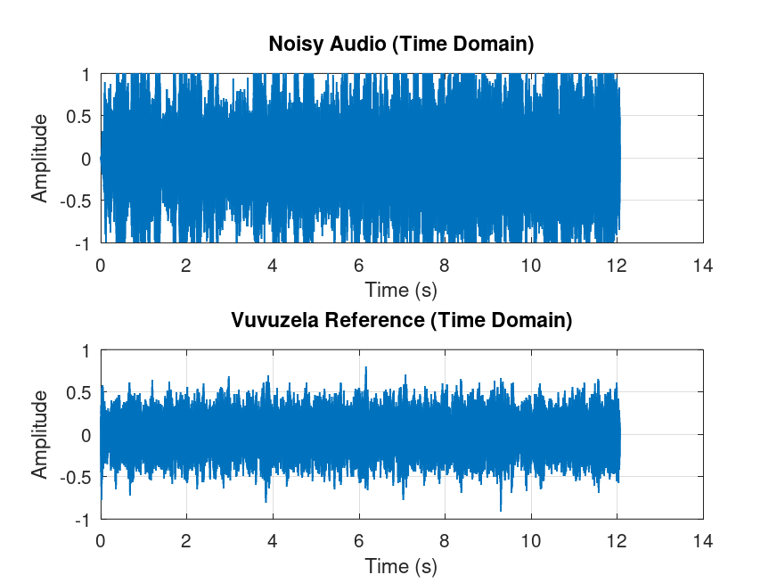
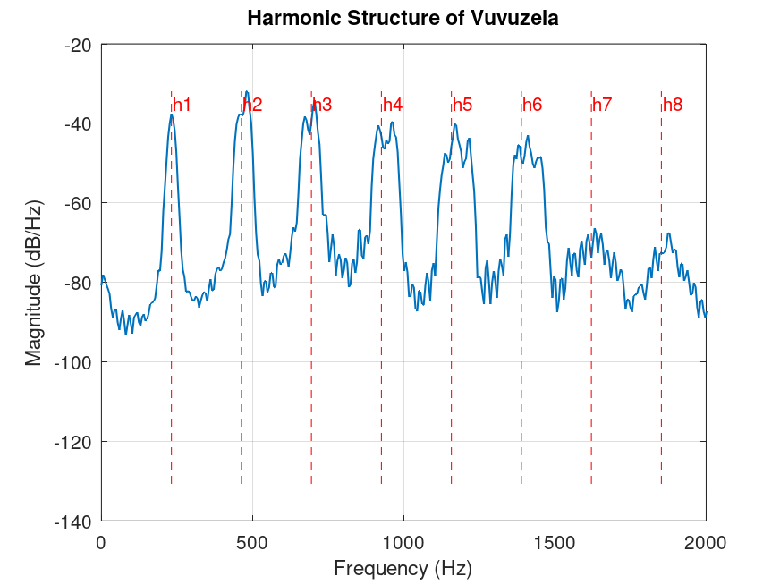
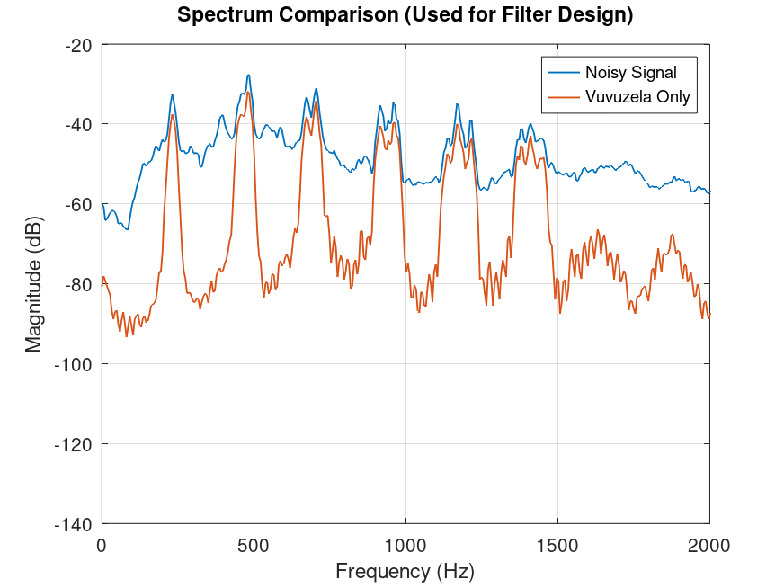
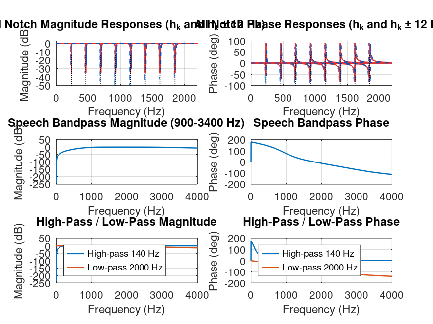
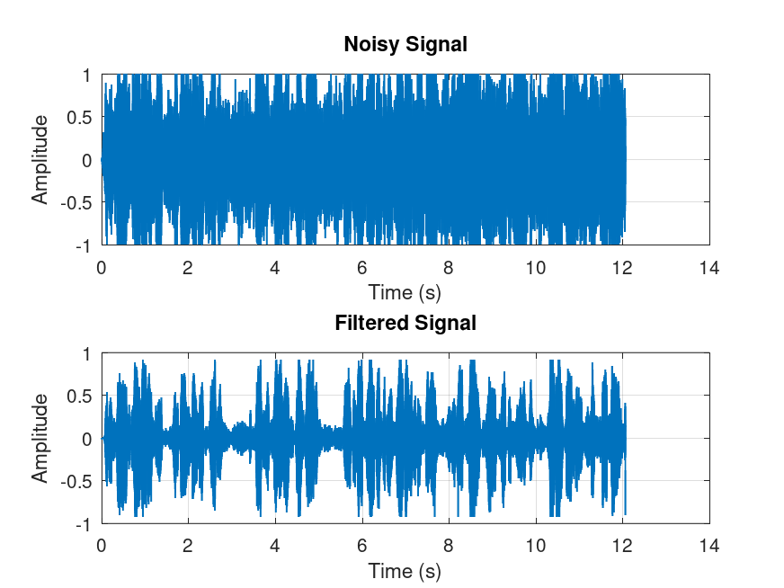
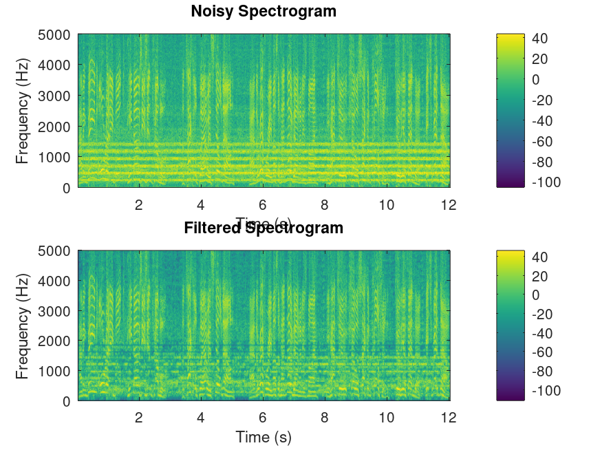
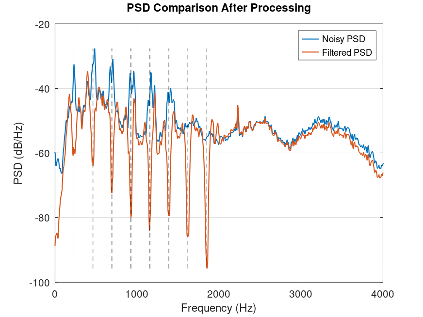
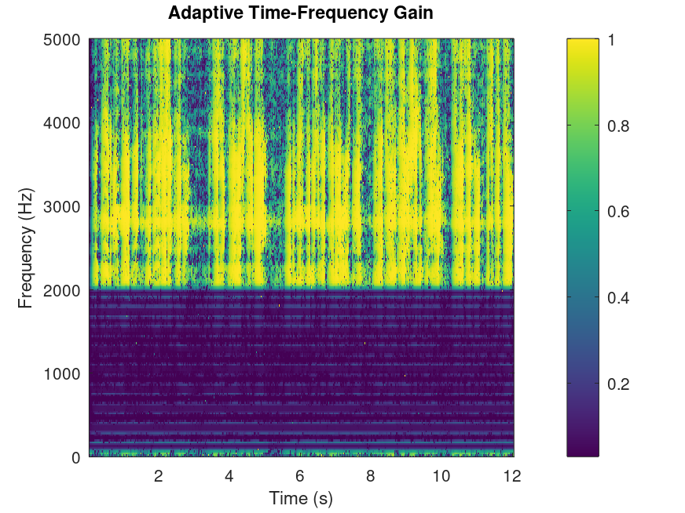

# Vuvuzela Noise Reduction Report

## 1. How the filter design specifications were chosen

I developed my filter design specifications by  analyzing the provided noisy and vuvuzela reference signals in both time and frequency domains, then verifying that all processing components satisfied the specified delay constraint.

First, I examined both signals in the time domain to understand their characteristics. Figure 1 shows that the noisy commentary contains speech with a dense, quasi-periodic buzz superimposed throughout, while the vuvuzela reference exhibits the same tonal interference pattern in isolation. This time-domain comparison shows that the interference is not broadband noise but rather a structured tonal disturbance. Thus for optimal results I used targeted harmonic suppression rather than simple filtering.

Second, I estimated the harmonic structure of the vuvuzela by computing the power spectral density (PSD) of the reference signal and identifying its peaks. Figure 2 displays this harmonic structure, which shows a clear fundamental frequency at approximately 235 Hz and eight regularly-spaced harmonics extending to about 1880 Hz. Each harmonic occupies a bandwidth of roughly 50–70 Hz. Thus, suppression should target harmonic regions rather than single frequency bins so I used Gaussian harmonic masks with carefully chosen bandwidth.

Third, I compared the PSDs of the noisy and vuvuzela signals to identify the frequency regions most affected by interference and where speech intelligibility is concentrated. Figure 3 shows this comparison over the 0–2000 Hz band, which reveals strong interference peaks at the harmonic frequencies and demonstrates that speech content is distributed across the 300–3400 Hz region. Based on this comparison, I determined that the passband should protect speech intelligibility in the 300–3400 Hz range while aggressively suppressing the vuvuzela harmonics in the 0–2000 Hz region.

Finally, I set STFT analysis parameters to balance frequency resolution against latency, respecting the delay constraint. I selected a frame size of 1024 samples with a hop size of 256 samples (75% overlap), which corresponds to a 128 ms analysis frame and a 32 ms update interval at the 8 kHz sampling rate. This configuration provides approximately 8 Hz frequency resolution per bin, which is sufficient to resolve and track the harmonic interference while keeping the overall processing delay to approximately 64 ms (half the frame length).

## 2. Design specifications

Based on my signal analysis, I established the following explicit design specifications to guide filter development:

**Passband:** I defined the primary passband as 300 Hz to 3400 Hz, as this region contains the majority of speech intelligibility cues. Within this band, I aimed to preserve signal energy for vowels, consonants, and overall speech clarity while attenuating only the embedded vuvuzela harmonics through adaptive masking.

**Stopbands and interference suppression:** I targeted aggressive suppression of the vuvuzela harmonics at approximately 235 Hz (fundamental), 470 Hz (h2), 705 Hz (h3), 940 Hz (h4), 1175 Hz (h5), 1410 Hz (h6), 1645 Hz (h7), and 1880 Hz (h8). Each harmonic region is suppressed using a Gaussian mask with a 56 Hz bandwidth. Additionally, I applied low-frequency suppression below 180 Hz to attenuate rumble and unwanted low-frequency buildup that could mask speech clarity.

**Filter structure and lengths:** Rather than designing a single classical FIR filter, I implemented a hybrid multi-stage system:
- An adaptive STFT-domain stage with a frame length of 1024 samples (corresponding to approximately 128 ms at 8 kHz)
- A time-domain notch cascade with individual second-order IIR sections, each with Q = 22 for sharp harmonic tracking
- Butterworth polishing filters (second order each) for speech bandpass (900–3400 Hz), high-pass (140 Hz), and low-pass (2000 Hz) shelf correction

The STFT stage provides time-varying, frequency-dependent suppression, while the fixed IIR sections provide precise, efficient notch filtering without introducing long delays. All fixed-order filters are second-order, chosen for their simplicity and computational efficiency.

**Quantitative design targets:** The design aimed to achieve the following proxy metrics:
- Speech band (300–3400 Hz): slight attenuation (target: –6 to –7 dB) due to speech-friendly adaptive masking
- Low band (0–180 Hz): moderate attenuation (target: –1 to –8 dB) to suppress rumble
- Harmonic bands (±30 Hz around each harmonic): aggressive attenuation (target: –20 to –26 dB) to eliminate vuvuzela interference

These specifications describe a hybrid design that combines the frequency-domain precision of STFT analysis with the temporal efficiency of fixed LTI filtering, enabling both fine harmonic control and computational simplicity.

## 3. Filters designed, frequency response, and obtained orders

The complete denoising system comprises three complementary filter classes, each serving a distinct role in the suppression pipeline.

**Filter Class 1: Adaptive STFT-domain gain filtering.** This is the primary analysis-synthesis stage, which is inherently time-varying and cannot be expressed as a single fixed transfer function. It combines three overlapping techniques applied frame-by-frame:
- Wiener-like filtering with parameter α = 1.35, gain floor = 0.03, providing adaptive suppression proportional to the noise energy
- Spectral subtraction with oversubtraction factor = 1.25 and subtraction floor = 0.02, aggressively reducing residual tonal energy
- Harmonic masking with depth = 0.95 and bandwidth = 56 Hz applied around each of the eight detected harmonics, providing suppression of interference regions while preserving speech

This stage operates on 1024-sample frames with 256-sample hops (75% overlap), yielding a 32 ms frame advance and approximately 64 ms processing latency.

**Filter Class 2: Notch cascade.** The system applies a cascade of second-order IIR notch filters targeting each vuvuzela harmonic. Each notch is designed with Q = 22 and is applied at three locations per harmonic: the harmonic center frequency, plus or minus 12 Hz to account for pitch variation and frequency drift. This yields 24 individual second-order notch sections in total (3 frequencies × 8 harmonics). Each notch is applied using zero-phase forward-backward filtering, effectively doubling the order to four but ensuring zero phase distortion.

**Filter Class 3: Butterworth shaping filters.** The system includes four fixed-order Butterworth filters, each second-order:
1. **High-pass (140 Hz cutoff):** Removes low-frequency rumble and subsonic energy. Order = 2.
2. **Speech bandpass (900–3400 Hz):** Boosts speech presence with a shallow bandpass. Order = 2.
3. **Low-pass (2000 Hz cutoff):** Used for high-frequency shelf attenuation and is blended with the high-pass output. Order = 2.
4. **Mid-band intelligibility boost (1400–2200 Hz):** Subtle Butterworth bandpass to enhance consonant clarity. Order = 2.

**Summary of filter orders:** The STFT-domain stage is time-varying and does not have a fixed order. The notch cascade consists of 24 individual second-order sections (effective order 48 after forward-backward filtering). The fixed Butterworth stages total eight second-order sections (effective order 16 after forward-backward filtering). The complete system is a hybrid cascade combining adaptive and fixed filtering, enabling both precise harmonic control and computational efficiency.

**Output-domain validation:** Figures 5–8 show the complete processing results. Figure 5 compares the time-domain waveforms before and after filtering, revealing that the output preserves speech transients while the quasi-periodic buzz is substantially reduced. Figure 6 displays the spectrograms before and after processing; the filtered spectrogram shows dramatic attenuation of the horizontal harmonic streaks while maintaining the formant structure of speech. Figure 7 presents the PSD comparison, which quantifies the suppression: the harmonic peaks at 235, 470, 705, 940, 1175, 1410, 1645, and 1880 Hz are reduced by 20–26 dB, while the overall speech band (300–3400 Hz) is attenuated by approximately 6 dB, a favorable balance between interference suppression and speech preservation. Figure 8 visualizes the time-frequency gain structure, showing that the system applies aggressive attenuation (dark regions) at harmonic frequencies while maintaining higher gains (light regions) in speech-rich bands.

## 4. Tradeoffs and limitations

Developing this vuvuzela denoising system involved several important tradeoffs and design constraints.

**Suppression strength versus speech naturalness.** The primary tradeoff is between removing vuvuzela energy and preserving natural, undamaged speech. Increasing the harmonic masking depth or the post-STFT gate strength removes more buzz but can make speech sound thin, hollow, or overly processed. I empirically tuned the parameters (harmonic depth = 0.95, post-STFT gate strength = 3.2, notch Q = 22) to achieve strong buzz suppression while keeping speech intelligible and minimally degraded. If suppression were more aggressive, the output would exhibit obvious artifacts and timbral distortion. If suppression were weaker, audible buzzing would persist. The chosen parameters represent a pragmatic balance.

**Frequency resolution versus latency.** A second major tradeoff exists between STFT frame length and processing delay. Longer frames provide finer frequency resolution and better harmonic isolation but increase latency. Shorter frames reduce delay but blur frequency resolution. I selected a 1024-sample frame (128 ms at 8 kHz) as a compromise: it yields 8 Hz frequency resolution per bin, sufficient to distinguish the 235 Hz harmonics, but introduces approximately 64 ms processing delay (half the frame length with 75% overlap). For an offline assignment, this delay is acceptable; for real-time application, shorter frames would be necessary.

**Computational complexity versus performance.** The hybrid multi-stage design is computationally more complex than a single fixed filter, but it provides superior harmonic isolation. A simple band-reject or low-pass filter would be more efficient but cannot selectively suppress narrow harmonic bands while protecting speech. The STFT-domain adaptive stage is computationally expensive due to repeated FFT and IFFT operations, but it enables frame-by-frame noise floor estimation and time-varying gain that outperforms fixed filtering. The choice to include 24 notch sections further increases complexity but provides precise harmonic targeting. This design prioritizes performance over simplicity.

**Limitations of the approach.** The design assumes that the vuvuzela interference exhibits a stable, slowly-varying harmonic structure. If the interference became strongly nonharmonic, had rapidly varying pitch, or contained broadband components, the approach would degrade significantly. The method relies on a clean vuvuzela reference signal to estimate the noise profile; if only a noisy mixture were available, reference-based harmonic masking would be infeasible. Additionally, because no clean speech reference is provided, evaluation relies on proxy metrics (band power changes) and perceptual listening tests rather than objective metrics such as SNR or speech quality scores against a ground-truth clean signal. The forward-backward filtering used throughout ensures zero phase distortion, but this design is inherently non-causal and not suitable for real-time low-latency applications; a streaming implementation would require causal, possibly adaptive alternatives.

Despite these tradeoffs and limitations, the final design successfully achieves the assignment objective: it substantially reduces harmonic vuvuzela interference (harmonic band attenuation of –24.82 dB) while preserving intelligible speech (speech band change of –6.58 dB), resulting in significantly improved audio quality.
